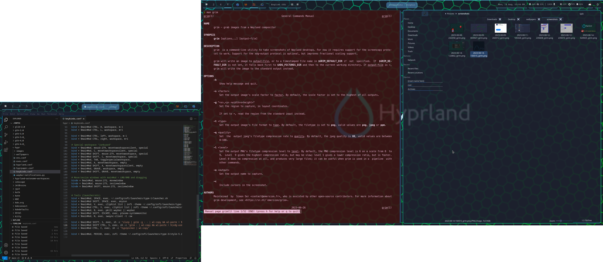
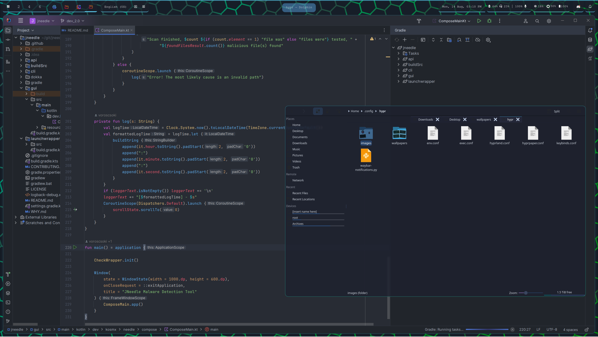

# Hypr dots

These are the config files I use on [Arch Linux](https://archlinux.org/) for a [Hyprland](https://hyprland.org/) based desktop environment  

## Inspiration, usage

It is a **template** what you can download, and modify without configuring everything from scratch.  
These files are not meant to be cloned and used without understanding their workings.  

Between the configs there is minimal cross-dependency, you should be able to use a components without using the whole config.

## Screenshots (rice)

    
Images

### A screenshot of my full desktop

### A random IntelliJ IDEA with a floating dolphin window

### rofi launcher

### Notification (control) center

## files, description, dependencies

  
Files and content (content of .config)

  
  ### Hyprland (WM)
  - `.config/hypr/`
    - `hyprland.conf` main configuration file, displays, style, input, window-rules
    - `env.conf` environment variables file (set for nvidia gpu)
    - `exec.fonf` stuff needed to be started when logging in
    - `keybinds.conf` All keybindings
    - `images/` Assets and tmp wallpaper asset
        - `hexgrid_empty.png` only important file here, used by pacwall as a background
    - `wallpapers/` Collection of wallpapers, wpaperd will choose a random from these.

    If you want to use this setup, fix your monitor setup in `hyprland.conf` and at least read (or edit) keybinds.conf

### rofi (launcher)
I use a template from https://github.com/adi1090x/rofi

After setting up, please update keybindings to use correct themes

Rofi is also used for clipboard history and emoji selector

### anyrun (launcher)
A simple minimal-config launcher (with calculator module)
You may want to use it instead of rofi

- `.config/anyrun`

### waybar (topbar)

My modules (on my desktop):
- left
    - a workspaces incicator (with one junkyard)
    - open apps indicator
    - keyboard layout and caps/num status
- center
    - current app title (orange for firefox, blue for everything else)
- right
    - time and weather
    - headset and audio control
    - RAM, brightness and battery
    - tray (hidden when empty)
    - notifications control center

files:

- `.config/waybar`
    - `config` modules per monitor config, you'll definitely need to edit this
    - `modules.json` modules I use with waybar (maybe the most interesting is swaync)
    - `scripts/`
        - `check_ups.sh` A desktop UPS battery level tool
        - `check_headset.sh` Logitech G733 battery indicator
        - `waybar-ddc-module` An external display brightness control
        - `wttr.py` Weather info helper
    - `style.css` Some status-bar functionality is only done by css

### wpaperd (wallpaper)
Simply show a random wallpaper every for every display
images are from `.config/hypr/wallpapers`

config: `.config/wpaperd/wallpaper.tomp`

### swaync (notifications)
A simple notification center with some app launcher and shutdown menu  
I used a template to configure it

### pacwall (dynamic wallpaper generator)
Generates a random entry into wallpaper directory. (There will be a small chance to be shown every time)
> To enable, `systemctl --user enable pacwall-watch-packages.path`

### Quick start
> If you want to start from this setup

    
How-to

1. Read the modules description for at least what you want to use
2. clone the repo and copy .config to your config dir
3. Edit some stuff
    - `.config/hypr/hyprland.conf` display order and keyboard layout(s)
    - `.config/hypr/` `env.conf` for environment, `exec.conf` for startup apps
    - `.config/hypr/keybinds.conf` Edit as you want it, or at least pin the config as a cheat-sheet
    - `.config/waybar/config` It's very unlikely that you can use my battery/screen/headset indicator, change as your current setup requires it. (Also change the weather location if you don't want to see Hungary/Budapest weather 🙃)
4. clone and setup https://github.com/adi1090x/rofi for rofi

Programs you'll need (most, not all):  
hyprland (hyprland-nvidia), waybar-hyprland-git (fix for notifications is already merged), swaync, slurp, grim, chiphist, hyprpicker, wpaperd, swayidle, swaylock

I use dolphin for file explorer and Konsole for terminal (for their terminal tab support), if you want to use something else, edit it in keybinds.conf

5. Keep ediging the configs as you wish. You should only use it as a quickstart template

> TODO (for me): Create a wallpaper with the more important shortcuts

### Happy hacking
